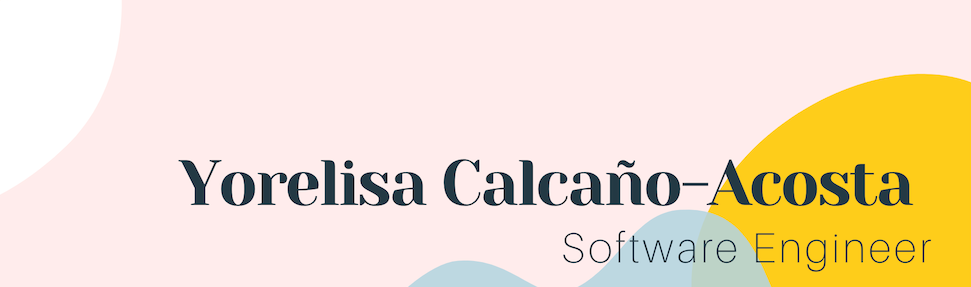

### Hi there 👋, I am Yorelisa 

I am a Latinx with experience in customer service and operations, who pivoted into tech. I have so much to offer in this field and with my attention to detail I could be an asset to your team. Please ask me about my first project with JavaScript which is the slot machine. 

Curently I am 🌱 learning about Object Oriented Programming.You could reach me via linkedIn or my Portfolio, both links are in my Bio.

-⚡ Fun fact: I have bungee jumped and would love to skydive one day! 

### Skills: 

### GitHub Stat:

 

<!--
**yorelisacodes/yorelisacodes** is a ✨ _special_ ✨ repository because its `README.md` (this file) appears on your GitHub profile.

Here are some ideas to get you started:

- 🔭 I’m currently working on ...
- 🌱 I’m currently learning ...
- 👯 I’m looking to collaborate on ...
- 🤔 I’m looking for help with ...
- 💬 Ask me about ...
- 📫 How to reach me: ...
- 😄 Pronouns: ...
- ⚡ Fun fact: ...
-->
